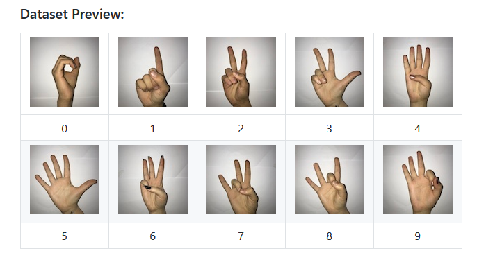

# Sign Language Digits Recognizer
In this repository we build our model and implemented using openCV the classification of Sign Language Digis using CNN from scratch.
Our dataset include images of Sign Language Digits from 0 to 9.

### Details of dataset
- Image size: 100 * 100
- Color space: RGB
- Numbers of labels(classes): 10 (0 - 9 digits)

You can find the dataset [here](https://github.com/ardamavi/Sign-Language-Digits-Dataset).

### CNN model
We have build a CNN model with 5 Convolution and MaxPooling layers followed by 2 Dense layer, which provide the output in range 0 - 9.

Our model provides 98.7% accuracy on training set and 98.4% accuracy on test set, which is quite good.

### Output
Following is the live classification output of our model seen using openCV.

